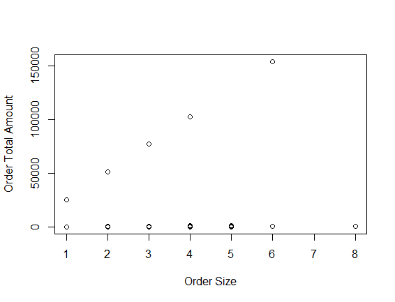

### Winter 2021 Shopify Data Science Intern Challenge
Language Used: R
----
### Question 1

### a. What is wrong with the calculation?
From initial analysis of the dataset, it\'s clear that the calculation of $3145.13 is simply the mean of the order_amount, which refers to the overall total. To begin to analyze what is wrong with this calculation, I calculated the interquartile range and plotted the order amount against the size of the order.

```{r}
# Read data in
shopify <- read.csv("2019 Winter Data Science Intern Challenge Data Set - Sheet1.csv")

# Question 1 Exploration

# Initial exploration of data
summary(shopify$order_amount)
plot(shopify$total_items,shopify$order_amount, 
     xlab="Order Size", ylab="Order Total Amount")
```

**Interquartile Range:**
* Minimum: 90
* 1st Quartile: 163
* Median: 284
* 3rd Quartile: 390
* Max: 704000


Immediately, we notice that the highest order total is 704000 and that the median of $284 is much lower than $3145.20. This suggests that there are a few outliers in the data that are pulling the mean higher. Means are typically more sensitive to outliers than other comparable measures of centrality.

When we pinpoint these orders, we find that $704000 refers to bulk orders of 2000 pairs of shoes valued at $352 each. This is likely a wholesale buyer that may be buying stock for their own store. Since this is a unique buying behavior and extreme outlier to the data (extreme outliers fall outside [-518, 1071]), for purposes of calculating an average order value that more accurately represents the average consumer, I chose to exclude these rows from the calculation. For now, I chose to only exclude extreme outliers to examine outliers that may have different explanations besides a bulk order.

Extreme Outliers:
* Upper = 3*(Q3 - Q1) + Q3 = 3*(390-163) + 390 = 1071
* Lower = 3*(Q3 - Q1) + Q3 = 163 - 3*(390-163) = -518

I generated another plot without the bulk order total amounts and noticed that there were several more shoes that were selling for over the calculated mean of $3145.13 even when buyers purchased less than 10 pairs. Therefore, I chose to investigate how much a single pair of shoes costs at each shop.

```{r}
# Identify and examine $704000 outlier
head(shopify[shopify$order_amount==704000,])

# Further examine without the bulk orders
shopify2 <- shopify[shopify$order_amount!=704000,]
plot(shopify2$total_items,shopify2$order_amount, 
     xlab="Order Size", ylab="Order Total Amount")
     
# Identify the shoes that sell for $25,725
shopify["product_price"] = shopify$order_amount/shopify$total_items
summary(shopify$product_price) # Max is $25,725, likely a luxury shoe seller?


iqr = as.double(quantile(shopify$order_amount)[4] - quantile(shopify$order_amount)[2])
upper = 3*(iqr) + as.double(quantile(shopify$order_amount)[4])
lower = as.double(quantile(shopify$order_amount)[2]) - 3*(iqr)

# Plot while excluding extreme outliers 
plot(shopify[shopify$order_amount<1071,]$order_amount, xlab="Order Size", ylab="Order Total")
```


I calculated the price of product by dividing the order_amount by total_items. Again, I started with looking at the interquartile range, noticing that the most expensive single pair of shoes is $25,725, sold by shop 78. This is likely a shop that specializes in luxury sneakers or has some other reasoning for offering such an expensive product. Seeing as there is only one shop with these prices, and this product is an outlier (Outliers fall outside [79, 223]), excluding these rows in our calculations could be an option.

**Interquartile Range:**
* Minimum: 90
* 1st Quartile: 133
* Median: 153
* 3rd Quartile: 169
* Max: 25725

**Therefore, from exploring the data, we know that the high average order calculation of $3,145.13 is due to directly calculating the mean of the order totals without cleaning the data or examining outliers such as large bulk orders and stores that may sell more expensive products.**

### b. What metric would be better to report?

* **Median** would be a much better metric to report. We prefer to avoid removing data as much as possible to retain the size and validity of the sample, particularly when we know that the data is accurately reported. Additionally, median is less sensitive to outlier data and provides a better measure of central tendency within a dataset without necessarily requiring us to remove outlier data. Reporting the median would allow us to move forward with our analysis using the entire sample.

That being said, the mean would also be appropriate if we clean the data up.
* If we still want to calculate an **average order value**, another option is to exclude the outliers that are skewing the mean calculation and recalculate with the new sample, understanding that we have removed points of variability within the sample. This would mean excluding all data that has an order_amount greater than $730.5, using the definition of an outlier as being either greater than Q3+1.5*(Q3-Q1) or less than Q1+1.5*(Q3-Q1). Before doing this, I also explored the order size and found that most big outlier data points are customers purchasing over 4 pairs of shoes, comprising 104 orders out of the 5000 in the dataset. The 141 orders that are outliers make up around 3% of the total dataset. For the purpose of calculating a mean, it would be acceptable to exclude said datapoints. 

* A more conservative approach that involves dropping less data would be to only drop the bulk orders and the store selling shoes for $25,725.

* Outside of order totals, I would also consider looking at order size. When examining how order size varied with the price of shoes, the median and mean both stayed consistent at 2 pairs per order when removing the bulk order and expensive stock rows, suggesting that an appropriate estimate could be multiplying each store's product price by 2 and taking the average.

Finally, I would also look at the standard deviation to give a better idea of variability. While the mean and median give us a measure of centrality, knowing the standard deviation can help us analyze the variability in the typical order.

Using median, mean, and standard deviation can allow us to have a better idea of variability in the overage order 

### c. What is its value?
```{r}
# Calculate statistics

# Median
median(shopify$order_amount)

# Average total order amount without all outliers
mean(shopify[shopify$order_amount<730.5,]$order_amount)

# Average total order amount excluding only two groups, 
# without considering definition of outlier
mean(shopify[shopify$product_price < 25725 & shopify$total_items < 2000,]$order_amount)
```
In this case, the median order value is **$284** for the entire dataset. This is the value I would recommend using as an estimate for a typical order total.

Other potential metrics:
The recalculated average order value is **$293.72** if we exclude all orders with an amount greater than $730.50. In doing so, this calculation drops 141 orders from the dataset, which are representating really big orders (typically more than 4 pairs of shoes) and shops that sell uniquely expensive stock.

The recalculated average order value would be **$302.58** if we only exclude the bulk orders (2000 pairs and more) and expensive stock ($25,725 per pair).

If we choose to generate an average by multiplying the average product price by two, the average order value would be **303.5771**.

-----
### Question 2

### a. How many orders were shipped by Speedy Express in total?
**54 unique orders** were shipped by Speedy Express in total. I joined Orders and Shippers on the common variable of ShipperID. I then utilized the COUNT function and DISTINCT keyword to identify the number of unique orders, using the WHERE command to isolate the query to only consider orders that were shipped by "Speedy Express."

```sql
SELECT COUNT(DISTINCT OrderID) AS speedy_shipped
	FROM Orders
    JOIN Shippers 
    ON Orders.ShipperID = Shippers.ShipperID
    WHERE Shippers.ShipperName = "Speedy Express"
```
### b. What is the last name of the employee with the most orders?
The last name of the employee with the most orders is **"Peacock."** This was determinted by joining the Orders and Employees tables, grouping the table by EmployeeID and then aggregating the number of orders with the COUNT function. I then selected the LastName and order count corresponding to the maximum number of orders.

```
WITH T AS (SELECT Employees.LastName,
		  COUNT(DISTINCT OrderID) AS num_orders
            FROM Employees
            LEFT JOIN Orders 
            ON Employees.EmployeeID = Orders.EmployeeID
            GROUP BY Employees.EmployeeID)
	SELECT * FROM T
	WHERE num_orders = (SELECT MAX(num_orders) FROM T)
```

### c. What product was ordered the most by customers in Germany?

**Boston Crab Meat (Product ID 40)** was ordered the most by customers in Germany. First, I joined Orders, OrderDetails, Products, and Customers to ensure I had all the variables needed for the query. A left join was used on products to ensure that all orders were retained in the query even if a product match could not be found. Then, I grouped the table by ProductID so I could aggregate the data using SUM to find the number of sales each product had. The WHERE function was used to extract only orders placed by customers in Germany. WITH was used to isolate the product with the most orders using the MAX function.

```
WITH T as (SELECT OrderDetails.ProductID, 
	   Products.ProductName,
       SUM(Quantity) AS total_ordered
	FROM OrderDetails
    JOIN Orders
    	ON OrderDetails.OrderID = Orders.OrderID
    LEFT JOIN Products
    	ON OrderDetails.ProductID = Products.ProductID
    JOIN Customers
    	ON Customers.CustomerID = Orders.CustomerID
    WHERE Country = "Germany"
    GROUP BY OrderDetails.ProductID
   )
   SELECT * FROM T 
   WHERE TOTAL_ORDERED = (SELECT MAX(TOTAL_ORDERED) FROM T)
```
